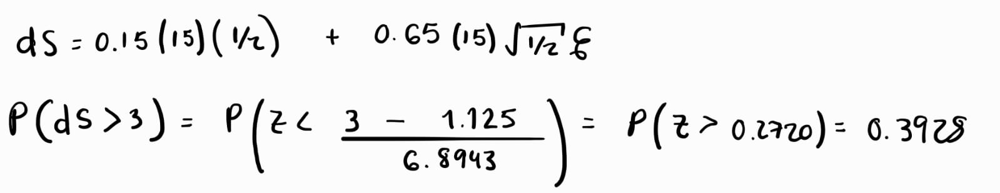

```{r}
suppressPackageStartupMessages(library(quantmod))
suppressPackageStartupMessages(library(lubridate))
```


# Ejercicio 1

**La probabilidad de que el cambio en el precio de BIMBO sea negativo en los próximos 5 días. Para determinar los parámetros usa los datos del 01-feb-24 al 01-Feb-25. Estima la probabilidad empírica de dos maneras:**

## Cálculo empírico

### Primero simula la ecuación St como lo hicimos en clase y calcula la probabilidad.

```{r}
datos <- new.env()
ticker <- "BIMBOA.MX"
getSymbols(ticker, env=datos, from="2024-02-01", to="2025-02-01")
precio <- datos[[ticker]][,6]
rendimiento <- na.omit(diff(log(precio)))


mu <- mean(rendimiento) * 252
sigma <- sd(rendimiento) * sqrt(252)
So <- as.numeric(tail(precio, n=1))

print(paste("Mu =", mu))
print(paste("Sigma =", sigma))


T <- 5/252    
dt <- T/(T*252)   
t <- seq(0, T, length.out=(T*252+1))
sim <- 100000


p_final_St <- numeric(sim)

for (i in 1:sim) {
  W <- c(0, cumsum(sqrt(dt)*rnorm(T*252)))
  St1 <- So*exp((mu-0.5*sigma^2)*t+sigma*W)
  p_final_St[i] <- St1[(T*252+1)]
}

probabilidad_St <- mean(p_final_St < So)
print(paste("Probabilidad de caída en 5 días (St) =", probabilidad_St))

```

### Segundo simula la ecuación ds en lugar de S y compara los resultados. Para simular ds, solo debes generar la cantidad de aleatorios necesarios para la simulación.

```{r}
p_final_ds <- numeric(sim)

for (i in 1:sim) {
  W <- c(0, cumsum(sqrt(dt)*rnorm(T*252)))
  ds <- So*mu*t+So*sigma*W
  p_final_ds[i] <- ds[(T*252+1)]
}

probabilidad_ds <- mean(p_final_ds<0)
print(paste("Probabilidad de caída en 5 días (ds) =", probabilidad_ds))
```

## Cálculo teórico

### Utilizando $\ln{S_T}$

{width="635"}

### Utilizando $ds$

{width="635"}

## Comparación

-   Calculando las probabilidades de manera empírica y teórica se obtienen prácticamente los mismos resultados.
-   Además, al ser una ventana de tiempo tan pequeña, el cálculo de la probabilidad con la ecuación $ds$ es más y $\ln{S_T}$ es casi igual. Sin embargo, al ser solamente 5 días, lo correcto sería utilizar la ecuación $ds$.

# Ejercicio 2

**Estima la misma probabilidad que la pregunta 1, pero ahora para dentro de un año.**

## Cálculo empírico

### Simulando la ecuación St.

```{r}
T <- 252/252   
dt <- T/(T*252)   
t <- seq(0, T, length.out=(T*252+1))
sim <- 100000


p_final_St <- numeric(sim)

for (i in 1:sim) {
  W <- c(0, cumsum(sqrt(dt)*rnorm(T*252)))
  St1 <- So*exp((mu-0.5*sigma^2)*t+sigma*W)
  p_final_St[i] <- St1[(T*252+1)]
}

probabilidad_St <- mean(p_final_St < So)
print(paste("Probabilidad de caída en un año (St) =", probabilidad_St))
```

### Simulando la ecuación ds.

```{r}
p_final_ds <- numeric(sim)

for (i in 1:sim) {
  W <- c(0, cumsum(sqrt(dt)*rnorm(T*252)))
  ds <- So*mu*t+So*sigma*W
  p_final_ds[i] <- ds[(T*252+1)]
}

probabilidad_ds <- mean(p_final_ds<0)
print(paste("Probabilidad de caída en un año (ds) =", probabilidad_ds))
```

## Cálculo teórico

### Utilizando $\ln{S_T}$

{width="635"}

### Utilizando $ds$

{width="635"}

# Ejercicio 3

**Analiza los resultados obtenidos tanto los ejercicios 1 y 2. ¿Qué puedes concluir sobre el uso de la ecuación ds o la ecuación ln St y St para calcular probabilidades?**

-   Se puede observar que cuando el horizonte de tiempo es pequeño (como en el ejercio 1) las probabilidades que fueron calculadas con la ecuación $ds$ y $\ln{S_T}$ son prácticamente iguales. Sin embargo, al aumentar el horizonte de tiempo (como en el ejercicio 2) las probabilidades calculadas con la ecuación $ds$ y $\ln{S_T}$ comienzan a cambiar entre sí. Esto se debe a que la ecuación $ds$ para horizontes de tiempo pequeños y para horizontes grandes es mejor utilizar la ecuación $\ln{S_T}$.

# Ejercicio 4

**Considera que el precio actual de un activo X, es de 15 y que tiene una media anual del 15% y volatilidad anual del 65%. Estima la probabilidad teórica y empírica de que el precio se mayor a 18 en 1 año, en seis meses y en un mes.**

## Cálculo empírico

### Simulando la ecuación St.

#### A un año

```{r}
mu <- 0.15
sigma <- 0.65
So <- 15
sim <- 100000

T <- 252/252   
dt <- T/(T*252)   
t <- seq(0, T, length.out=(T*252+1))
sim <- 100000


p_final_St <- numeric(sim)

for (i in 1:sim) {
  W <- c(0, cumsum(sqrt(dt)*rnorm(T*252)))
  St1 <- So*exp((mu-0.5*sigma^2)*t+sigma*W)
  p_final_St[i] <- St1[(T*252+1)]
}

probabilidad_St <- mean(p_final_St > 18)
print(paste("A un año P(St>18)=", probabilidad_St))

```

#### A seis meses

```{r}

T <- (252/2)/252   
dt <- T/(T*252)   
t <- seq(0, T, length.out=(T*252+1))
sim <- 100000

p_final_St <- numeric(sim)

for (i in 1:sim) {
  W <- c(0, cumsum(sqrt(dt)*rnorm(T*252)))
  St1 <- So*exp((mu-0.5*sigma^2)*t+sigma*W)
  p_final_St[i] <- St1[(T*252+1)]
}

probabilidad_St <- mean(p_final_St > 18)
print(paste("A 6 meses P(St>18)=", probabilidad_St))

```

#### A un mes

```{r}

T <- (252/12)/252   
dt <- T/(T*252)   
t <- seq(0, T, length.out=(T*252+1))
sim <- 100000

p_final_St <- numeric(sim)

for (i in 1:sim) {
  W <- c(0, cumsum(sqrt(dt)*rnorm(T*252)))
  St1 <- So*exp((mu-0.5*sigma^2)*t+sigma*W)
  p_final_St[i] <- St1[(T*252+1)]
}

probabilidad_St <- mean(p_final_St > 18)
print(paste("A 1 mes P(St>18)=", probabilidad_St))

```


### Simulando la ecuación ds.

#### A un año

```{r}

T <- (252/1)/252   
dt <- T/(T*252)   
t <- seq(0, T, length.out=(T*252+1))
sim <- 100000

p_final_ds <- numeric(sim)

for (i in 1:sim) {
  W <- c(0, cumsum(sqrt(dt)*rnorm(T*252)))
  ds <- So*mu*t+So*sigma*W
  p_final_ds[i] <- ds[(T*252+1)]
}

probabilidad_ds <- mean(p_final_ds>3)
print(paste("A un año P(ds>3)=", probabilidad_ds))
```

#### A seis meses

```{r}

T <- (252/2)/252   
dt <- T/(T*252)   
t <- seq(0, T, length.out=(T*252+1))
sim <- 100000

p_final_ds <- numeric(sim)

for (i in 1:sim) {
  W <- c(0, cumsum(sqrt(dt)*rnorm(T*252)))
  ds <- So*mu*t+So*sigma*W
  p_final_ds[i] <- ds[(T*252+1)]
}

probabilidad_ds <- mean(p_final_ds>3)
print(paste("A 6 meses P(ds>3)=", probabilidad_ds))
```

#### A un mes

```{r}

T <- (252/12)/252   
dt <- T/(T*252)   
t <- seq(0, T, length.out=(T*252+1))
sim <- 100000

p_final_ds <- numeric(sim)

for (i in 1:sim) {
  W <- c(0, cumsum(sqrt(dt)*rnorm(T*252)))
  ds <- So*mu*t+So*sigma*W
  p_final_ds[i] <- ds[(T*252+1)]
}

probabilidad_ds <- mean(p_final_ds>3)
print(paste("A 1 mes P(ds>3)=", probabilidad_ds))
```

## Cálculo teórico

### Utilizando $\ln{S_T}$

#### A un año

{width="635"}

#### A seis meses

{width="635"}

#### A un mes

{width="635"}

### Utilizando $ds$

#### A un año

{width="635"}

#### A seis meses

{width="635"}

#### A un mes

{width="635"}

# Ejercicio 5

**Modifica tu código de la pregunta 4 para que puedas calcular la misma probabilidad para valores de t, desde t=1, hasta t=240 (es decir 20 años). Efectúa una gráfica la probabilidad, donde en el eje vertical se vea el tiempo y en el horizontal la probabilidad. Describe la gráfica que obtuviste. ¿Qué puedes concluir sobre la relación que observas en la gráfica entre el tiempo y la probabilidad?**

```{r}
library(ggplot2)

So <- 15 
mu <- 0.15  
sigma <- 0.65  
N <- 100000

t_seq <- seq(1, 240, by=1) / 12 

prob_empirica_t <- sapply(t_seq, function(dt) {
  Z <- rnorm(N) 
  St <- So * exp((mu - 0.5 * sigma^2) * dt + sigma * sqrt(dt) * Z) 
  mean(St > 18) 
})

probabilidad_dS <- sapply(t_seq, function(dt) {
  dS <- mu * So * dt + sigma * So * rnorm(N) * sqrt(dt)  
  St_dS <- So + dS 
  mean(St_dS > 18)
})

df_t <- data.frame(
  Tiempo = t_seq,
  Probabilidad_Empirica = prob_empirica_t,
  Probabilidad_dS = probabilidad_dS
)

ggplot(df_t, aes(x = Tiempo)) +
  geom_line(aes(y = Probabilidad_Empirica, color = "Probabilidad St"), size = 1) +
  geom_line(aes(y = Probabilidad_dS, color = "Probabilidad dS"), size = 1) +
  scale_color_manual(values = c("Probabilidad St" = "cadetblue", "Probabilidad dS" = "seagreen")) +
  labs(title = "Compraración ds y St",
       x = "Tiempo (años)",
       y = "Probabilidad",
       color = "Leyenda") +
  theme(legend.position = "right")

```

## Conclusión


