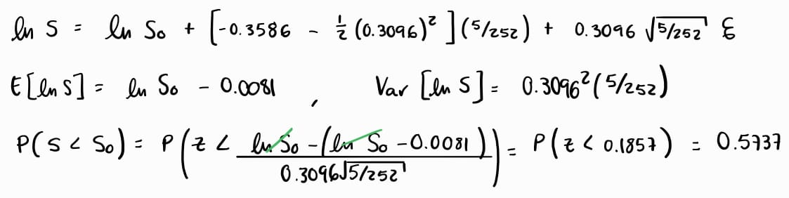

# Ejercicio 1

La probabilidad de que el cambio en el precio de BIMBO sea negativo en los próximos 5 días. Para determinar los parámetros usa los datos del 01-feb-24 al 01-Feb-25. Estima la probabilidad empírica de dos maneras:

## Cálculo empírico

### Primero simula la ecuación St como lo hicimos en clase y calcula la probabilidad.

```{r}
library(quantmod)

datos <- new.env()
ticker <- "BIMBOA.MX"
getSymbols(ticker, env=datos, from="2024-02-01", to="2025-02-01")
precio <- datos[[ticker]][,6]
rendimiento <- na.omit(diff(log(precio)))


mu <- mean(rendimiento) * 252
sigma <- sd(rendimiento) * sqrt(252)
So <- as.numeric(tail(precio, n=1))

print(paste("Mu =", mu))
print(paste("Sigma =", sigma))


T <- 5    # Horizonte de 5 días
dt <- 1/252   # Cada paso es un día
sim <- 100000


p_final_St <- numeric(sim)

for (i in 1:sim) {
  W <- cumsum(sqrt(dt) * rnorm(T))  # Movimiento browniano en T días
  St1 <- So * exp((mu - 0.5 * sigma^2) * (1:T) * dt + sigma * W)
  p_final_St[i] <- St1[T] 
}

probabilidad_St <- mean(p_final_St < So)
print(paste("Probabilidad de caída en 5 días (St) =", probabilidad_St))

```

### Segundo simula la ecuación ds en lugar de S y compara los resultados. Para simular ds, solo debes generar la cantidad de aleatorios necesarios para la simulación.

```{r}
p_final_ds <- numeric(sim)

for (i in 1:sim) {
  dS <- So * (mu * dt + sigma * sqrt(dt) * rnorm(T))
  St2 <- So + cumsum(dS)  # Acumulamos los cambios de precio
  p_final_ds[i] <- St2[T]
}

# Cálculo de la probabilidad empírica con dS
probabilidad_ds <- mean(p_final_ds < So)
print(paste("Probabilidad de caída en 5 días (dS) =", probabilidad_ds))
```

## Cálculo teórico

### Utilizando $\ln{S_T}$

{width="635"}

### Utilizando $ds$

{width="635"}

# Ejercicio 2

Estima la misma probabilidad que la pregunta 1, pero ahora para dentro de un año.

## Cálculo empírico

### Simulando la ecuación St.

```{r}
T <- 252    # Horizonte de 252 días
dt <- 1/252   # Cada paso es un día
sim <- 100000


p_final_St <- numeric(sim)

for (i in 1:sim) {
  W <- cumsum(sqrt(dt) * rnorm(T))  # Movimiento browniano en T días
  St1 <- So * exp((mu - 0.5 * sigma^2) * (1:T) * dt + sigma * W)
  p_final_St[i] <- St1[T] 
}

probabilidad_St <- mean(p_final_St < So)
print(paste("Probabilidad de caída en un año (St) =", probabilidad_St))
```

### Simulando la ecuación ds.

```{r}
p_final_ds <- numeric(sim)

for (i in 1:sim) {
  dS <- So * (mu * dt + sigma * sqrt(dt) * rnorm(T))
  St2 <- So + cumsum(dS)  # Acumulamos los cambios de precio
  p_final_ds[i] <- St2[T]
}

# Cálculo de la probabilidad empírica con dS
probabilidad_ds <- mean(p_final_ds < So)
print(paste("Probabilidad de caída en un año (dS) =", probabilidad_ds))
```

## Cálculo teórico

### Utilizando $\ln{S_T}$

{width="635"}

### Utilizando $ds$

{width="635"}
